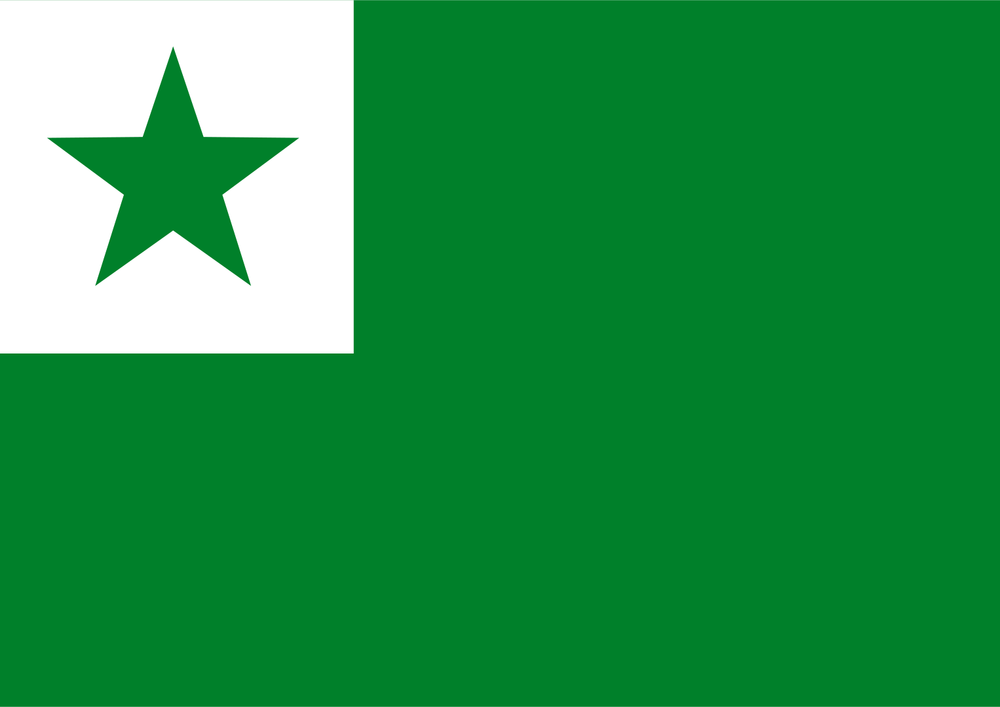

= arcaicam Esperantom: Facila Gvido
+
Ekstrakto de la originala libro kun pli da ekzemploj kaj vortprovizo.
:doctype: book
:email: kroyxt@gmail.com
:title-logo-image: 
:toc: macro
:toc-title: Tabelom Enhawes
:table-stripes: even

[colophon, discrete]
== {doctitle}
Titolo:: {doctitle}
Dato:: 2024
Aŭtoro:: Kristian Soto
Licenco:: "{doctitle} © 2024 bay Kristian Soto es lisensen bay CC BY-NC 4.0"

toc::[]

== Ortografio

[cols="^1,^1,^1"]
|===
| Esperanto | arcaicam Esperantom | Prononco

| aŭ  | aù   | aw
| c   | tz   | ts
| ĉ   | ch   | tš
| z   | zz   | dz
| eŭ  | eù   | ew
| f   | ph   | f
| g   | g[u] | g
| gv  | gù   | gw
| ĝ   | gh   | dž
| ĥ   | qh   | x
| j   | y    | j
| ĵ   | zh   | ž
| k   | c/qu | k
| ks  | x    | ks
| kv  | cù   | kw
| ŝ   | sh   | š
| ŭ   | ù    | w
| v   | w    | v
| -e  | -œ   | Ø
| -aŭ | -ez  | ez
|===

* *g* igas *"gu"* antaŭ la litero *e** kaj *i* kaj *"g"* antaŭ aliaj literoj.

* *k* igas *"qu"* antaŭ la litero *e** kaj *i* kaj *"c"* antaŭ aliaj literoj.

* La *œ*, kiu rolas kiel adverba sufikso, estas nove enkondukita fonemo,
  prononce egala al la germana ő en schőn, la dana ø en fører, aŭ la franca eu
  en bleu. Tiu kiu ne kapablas ĝin prononci, diru simple eŭ.

== Deklinacioj

Substantivoj, adjektivoj, korelativoj, pronomoj kaj familiaraj propraj nomoj
estas deklinaciataj. Fremda propra nomo aŭ titolo restas senŝanĝa, sed ĝi povas
ricevi la novan prepozicion no kiu anstataŭige ricevas la koncernan deklinacian
sufikson:

[%autowidth%header,cols="1,1"]
|===
| Esperanto | arcaicam Esperantom

| li vendis la ĉevalojn de mia malfeliĉa bofrato | wend**it** Chewalo**yn** mih**es** powr**es** Bophrat**es**
| (ni) jam spektis la “Tri Muskedistoj”-n        | yam spektiims **noyn** "Trid Musquedistoy"
|===

Ĉiuj propraj nomoj, samkiel substantivoj, skribiĝas ĉiam kun komenca majusklo.

=== Nominativo

[cols="1,1"]
|===
| Esperanto | arcaicam Esperantom

| -o | -om
| -oj | -oy
|===

La nominativo je **–m** aplikiĝas kiel kutime, por subjekta substantivo kaj
adjektivo. Ĝi malaperas en kunmetaĵo:

[cols="1,1"]
|===
| Esperanto | arcaicam Esperantom

| aperis granda profeto, kiu instruis... | grand**am** Prophet**om** aperit, cuyu instruit...
| partopreni                             | part**o**prenir
|===

=== Akusativo

[cols="1,1"]
|===
| Esperanto | arcaicam Esperantom

| Ununombra  | -on  | -on
| Plurnombra | -ojn | -oyn
|===

La akuzativo je **–n** estas uzata kiel kutime, por senpera komplemento:

[cols="1,1"]
|===
| Esperanto | arcaicam Esperantom

| Oni pelĉasos la sovaĝan beston | sowagh**an** Best**on** oni pelchasot
|===

=== Genitivo

[cols="1,1"]
|===
| Esperanto | arcaicam Esperantom

| de -o  | -es
| de -oj | -eys
|===

La genitivo je **–es** aplikiĝas, jen anstataŭ la prepozicio **del** jen post
ĝi:

[cols="1,1"]
|===
| Esperanto                    | arcaicam Esperantom

| la glavo de lia spirito      | Glawom lùi**es** Spirit**es**
| ŝi manĝis amason da vinberoj | manghit eshi Amason **del** Winber**eys**
|===

=== Dativo

[cols="1,1"]
|===
| Esperanto | arcaicam Esperantom

| al -o  | -od
| al -oj | -oyd
|===

La dativo je **–d** aperas ĉe direkta akuzativo, kondiĉe ke tiu aperas en la
aktuala lingvo, sed ankaŭ post **grez** kaj **malgrez**:

[cols="1,1"]
|===
| Esperanto         | arcaicam Esperantom

| al ni malpermesus | nos**id** malpermesut
| dank’al Dio!      | grez Di**od**!
|===

== Konjugacioj

=== Indikativo

[cols="^1,^1,^1,1,1"]
|===
| Preterito | Prezenco | Futuro | Ekzemploj        | Traduko

| -ims      | -ams     | -oms   | mihi phar**ims** | mi faris
| -is       | -as      | -os    | tu phar**as**    | ci faras
| -it       | -at      | -ot    | lùi phar**ot**   | li faros
|           |          |        | eshi phar**it**  | ŝi faris
|           |          |        | eghi phar**at**  | ĝi faras
|           |          |        | onphar**ot**     | oni faras
| -iims     | -aims    | -oims  | nos phar**iims** | ni faris
| -iis      | -ais     | -ois   | wos phar**ais**  | vi faris
| -iit      | -ait     | -oit   | ilùi phar**oit** | ili faros
|===

La sufiksoj markas gramatikan personon kaj nombron:

[cols="^1,^1"]
|===
| Pronomo | Estis

| [mi]    | Estims
| [ci]    | Estis
| [ĝi]    | Estit
|===

[cols="^1,^1"]
|===
| Pronomo | Farus

| [oni]   | onpharut
| [ni]    | pharuims
| [vi]    | phariuis
|===

=== Infinitivo

[cols="^1,^1"]
|===
| Esperanto | arcaicam Esperantom

| pardoni   | pardon**ir**
| ventumi   | wentum**ir**
| baloti    | balot**ir**
| konduki   | conduqu**ir**
| ataki     | ataqu**ir**
| allasi    | adlas**ir**
|===

Ankaŭ la sufikso -ad tradukiĝas per la infinitiva *-ir*

[cols="^1,^1"]
|===
| Esperanto  | arcaicam Esperantom

| leg**ad**o | legu**ir**om
| bat**ad**o | bat**ir**om
|===

=== Kondicionalo

[cols="^1,1,1"]
|===
|        | Ekzemploj       | Traduko

| -ums   | mihi haw**ums** | mi havus
| -us    | tu haw**us**    | ci havus
| -ut    | eshi haw**ut**  | ŝi havut
| -uims  | nos haw**uims** | ni havus
| -uis   | wos haw**uis**  | vi havus
| -uit   | ilùi haw**uit** | ili havus
|===

=== Volitivo

[cols="^1,1,1"]
|===
| Esperanto | Ekzemploj         | Traduko

| -u        | silent**u** mihi! | mi silentu!
| -uy       | Silent**uy** nos! | ni silentu!
|===

=== Kunmetitaj tempoj

Okazas laŭ la kutima metodo:

[cols="1,1"]
|===
| Esperanto             | arcaicam Esperantom

| ni estis perfortante  | estiims perphort**antœ**
| li estos tie nekonata | ityœ nedcon**atam** estot
|===

== Pronomoj

[cols="^1,^1,^1,^1,^1,^1"]
|===
| Esperanto | Nominativo | Genitivo | Akuzativo | Dativo | Adjektivo

| mi        | mihi       | mihes    | mihin     | mihid  | miham
| ci        | tu         | tues     | tuin      | tuid   | tuam
| li        | lùi        | lùies    | lùin      | lùid   | lùiam
| ŝi        | eshi       | eshies   | eshin     | eshid  | eshiam
| ĝi        | eghi       | eghies   | eghin     | eghid  | eghiam
| ni        | nos        | noses    | nosin     | nosid  | nosam
| vi        | wos        | woses    | wosin     | wosid  | wosam
| ili       | ilùi       | ilùies   | ilùin     | ilùid  | ilùiam
| si        | sihi       | sihes    | sihin     | sihid  | siham
|===

Estas bona stilo ignori pronomon, kiam la deklinaciita verbo per si mem sufiĉe
klare indikas pri kiu gramatika persono temas:

|===
| Esperanto                 | arcaicam Esperantom

| ni ne scias kion ni faros | ned stzia**ims** cuyon pharo**iims**
|===

Anstataŭ:

* nos ned stziaims cuyon nos pharoims

La ĝenerala pronomo **oni**  aperas ofte kiel prefikso.

|===
| Esperanto                 | arcaicam Esperantom

| oni ne premu tro forte    | **on**premu ned tro phortœ
| malpermesite estas al oni | ad**oni** malpermesitœ estat
|===

Ili ne akceptas komencan majusklon, krom por honoriga emfazo:

* `lùiam Mastrom` sed `Lùiam Mastrom`

Estas enkondukita la nova pronomo **egui** kiu indikas personon, sekse neŭtran:

* radiantam Anghelom, **egui** lùid dirit...

== Numeraloj

|===
| 1     | 2     | 3     | 4     | 5     | 6     | 7     | 8     | 9     | 10

| unn   | dux   | trid  | cùar  | qùin  | ses   | sep   | oc    | naù   | dec
|===

|===
| 100   | 1000  | 10000000

| tzent | mill  | milyon
|===

La kunmetado restas sema kiel en la Fundamento.

== Artikolo

Defina artikolo ne ekzistas. Se necese, oni anstataŭigu ĝin per **ìtyu**:

|===
| Esperanto                 | arcaicam Esperantom

| Renardo la vulpo          | Renardom **ityu** Wulpom
| fine ŝi trovis la moneron | phinœ eshi **ityu**n Moneron trowit
|===

La nedefina artikolo estas unn:

|===
| Esperanto         | arcaicam Esperantom

| vidvino kiu...    | **unn** Widwinnom cuyu...
| iu vidvino kiu... | heyu Widwinnom cuyu...
|===

== Korelativoj

[cols="^1,^1"]
|===
| Esperanto | acaicam Esperantom

| ali-      | altri-
| ĉi-       | chey-
| i-        | hey-
| ki-       | cuy-
| neni-     | nemy-
| ti-       | ity-
|===

[cols="^1,^1"]
|===
| Esperanto | acaicam Esperantom

| -a        | -am
| -am       | -ahem
| -e        | -œ
| -o        | -om
| -om       | -ohem
|===

Aliaj finaĵoj restas same

=== Kolektiva

[cols="^1,^1"]
|===
| Esperanto | acaicam Esperantom

| Ĉia       | cheyam
| Ĉiu       | cheyu
| Ĉio       | cheyom
| Ĉies      | cheyes
| Ĉiel      | cheyel
| Ĉie       | cheyœ
| Ĉiam      | cheyahem
| Ĉiom      | cheyohem
| Ĉial      | cheyal
|===

=== Nedeterminita

[cols="^1,^1"]
|===
| Esperanto | acaicam Esperantom

| Ia        | heyam
| Iu        | heyu
| Io        | heyom
| Ies       | heyes
| Iel       | heyel
| Ie        | heyœ
| Iam       | heyahem
| Iom       | heyohem
| Ial       | heyal
|===

=== Relativa kaj Demanda

[cols="^1,^1"]
|===
| Esperanto | acaicam Esperantom

| Kia       | cuyam
| Kiu       | cuyu
| Kio       | cuyom
| Kies      | cuyes
| Kiel      | cuyel
| Kie       | cuyœ
| Kiam      | cuyahem
| Kiom      | cuyohem
| Kial      | cuyal
|===

=== Negativa

[cols="^1,^1"]
|===
| Esperanto | acaicam Esperantom

| Nenia     | nemyam
| Neniu     | nemyu
| Nenio     | nemyom
| Nenies    | nemyes
| Neniel    | nemyel
| Nenie     | nemyœ
| Neniam    | nemyahem
| Neniom    | nemyohem
| Nenial    | nemyal
|===

=== Demonstrativa

[cols="^1,^1"]
|===
| Esperanto | acaicam Esperantom

| Tia       | ìtyam
| Tiu       | ìtyu
| Tio       | ìtyom
| Ties      | ìtyes
| Tiel      | ìtyel
| Tie       | ìtyœ
| Tiam      | ìtyahem
| Tiom      | ìtyohem
| Tial      | ìtyal
|===

=== Alia

[cols="^1,^1"]
|===
| Esperanto | acaicam Esperantom

| alia      | altriam
| aliu      | altriu
| alio      | altriom
| alies     | altries
| aliel     | altriel
| alie      | altriœ
| aliam     | altriahem
| aliom     | altriohem
| alial     | altrial
|===

=== Plej Nedefinita

[cols="^1,^1"]
|===
| Esperanto | acaicam Esperantom

| ajn       | -dìe
|===

[cols="^1,^1"]
|===
| Esperanto | acaicam Esperantom

| Ia ajn    | heyamdìe
| Iu ajn    | heyudìe
| Io ajn    | heyomdìe
| Ies ajn   | heyesdìe
| Iel ajn   | heyeldìe
| Ie ajn    | heyœdìe
| Iam ajn   | heyahemdìe
| Iom ajn   | heyohemdìe
| Ial ajn   | heyaldìe
|===

=== Proksimeco

[cols="^1,^1"]
|===
| Esperanto | acaicam Esperantom

| ĉi-       | ìs-
|===

[cols="^1,^1"]
|===
| Esperanto | acaicam Esperantom

| Ĉi tia    | ìsityam
| Ĉi tiu    | ìsityu
| Ĉi tio    | ìsityom
| Ĉi ties   | ìsityes
| Ĉi tiel   | ìsityel
| Ĉi tie    | ìsityœ
| Ĉi tiam   | ìsityahem
| Ĉi tiom   | ìsityohem
| Ĉi tial   | ìsityal
|===

* Ili *ne prenas majusklon* ĉe substantiva uzo, male al koncernaj substantivoj.

* Notu ke la radiko *altri-* plu ne havas la karakteron de adjektivo, sed estas
  plenrajta korelativo.

== Konjuncioj

[cols="^1,^1"]
|===
| Esperanto | Arcaicam Esperantom

| aŭ        | au
| ĉar       | char
| ĉu        | chu( des)
| ĉu jes?   | Werœ?
| cu ne?    | Phalsœ?
| do        | des
| Jen       | yemen
| kaj       | ed
| ke        | que
| sed       | sed
| kvankam   | cùanquez
| Kvazaŭ    | cùazes
| malgraŭ   | malgrez
| nek       | nec
| nu        | nu
| ol        | ol
| tamen     | tamen
| se        | se
| ju        | yud
| des       | desto
|===

== Prepozicioj

|===
| Esperanto     | arcaicam Esperantom

| al            | ad(i)
| anstataŭ      | anstatez
| antaŭ[loko]   | antez
| antaŭ[tempo]  | prezz
| apud          | apud
| cis           | cis
| ĉe            | chez
| ĉirkaŭ        | chirquez
| da            | del
| de            | del
| dum           | dum(quez)
| ekde          | ab(u)
| ekster        | extrum
| el            | ex
| en            | in
| ĝis           | ghisquez
| inter         | inter
| je            | iyed
| kontraŭ       | contrez
| krom          | crom
| kun           | cum
| laŭ           | selez
| per           | per
| po            | pod
| por           | por
| post[loko]    | postez
| post[tempo]   | post
| preter        | predor
| pri           | prid
| pro           | pru
| sen           | sons
| sub           | subez
| super         | suprez
| sur           | sobrez
| tra           | tra
| trans         | trans
|===

== Vortareto

=== Substantivoj

|===
| Esperanto    | arcaicam Esperantom

| Adreso       | Adresom
| Afero        | Apherom
| Amaso        | Amasom
| Amiko        | Amicom
| Aparato      | Aparatom
| Avo          | Awom
| Bildo        | Bildom
| Bileto       | Biletom
| Buso         | Busom
| Ĉambro       | Chambrom
| Ĉefo         | Chephom
| Domo         | Domom
| Edzo         | Edzzom
| Ekzemplo     | Ekzzemplom
| Fakto        | Pactom
| Familio      | Phamiliom
| Filmo        | Philmom
| Fino         | Phinom
| Flanko       | Phlancom
| Fraŭlo       | Scùirom
| Fraŭlino     | Damselom
| Fojo         | Phoyom
| Formo        | Phormom
| Frato        | Phratom
| Grupo        | Grupom
| Homo         | Homom
| Horo         | Horom
| Ideo         | Ideom
| Jaro         | Yarom
| Kampo        | Campom
| Kazo         | Cazzom
| Knabo        | Knabom
| Kulturo      | Culturom
| Lando        | Landom
| Libro        | Librom
| Lingvo       | Lingúom
| Loko         | Locom
| Maniero      | Manierom
| Mano         | Manom
| Mateno       | Matenom
| Materialo    | Materialom
| Membro       | Membrom
| Mil          | mill
| Miljardo     | Milyard
| Miljono      | Milyon
| Minuto       | Minutom
| Momento      | Momentom
| Mondo        | Mondom
| Mono         | Monom
| Nacio        | Natziom
| Nokto        | Noctom
| Nomo         | Nomom
| Numero       | Numerom
| Ordo         | Ordom
| Papero       | Paperom
| Parto        | Partom
| Patro        | Patrom
| Paĝo         | Paghom
| Piedo        | Piedom
| Plano        | Planom
| Pomo         | Pomom
| Prelego      | Prelegom
| Prezo        | Prezzom
| Problemo     | Problemom
| Programo     | Programom
| Regiono      | Reguionom
| Regulo       | Regulom
| Rivero       | Riwerom
| Scienco      | Stzientzom
| Semajno      | Semaynom
| Sinjoro      | Mesirom
| Sinjorino    | Damom
| Situacio     | Situatziom
| Skatolo      | Scatolom
| Strato       | Stratom
| Tago         | Tagom
| Tasko        | Tasckom
| Tempo        | Tempom
| Universitato | Uniwersitatom
| Urbo         | Rubom
| Varo         | Warom
| Vespero      | Wesperom
| Viro         | Wirom
| Vorto        | Wortom
|===

=== Adjektivoj

|===
| Esperanto  | arcaicam Esperantom

| Alia       | altriam
| Alloga     | adlogam
| Alta       | altam
| Aparta     | apartam
| Baza       | bazam
| Bela       | belam
| Bona       | bonam
| Certa      | tzertam
| Ĉarma      | charmam
| Facila     | phacilam
| Forta      | phortam
| Frua       | phruam
| Granda     | grandam
| Grava      | grawam
| Ĝenerala   | gheneralam
| Ĝusta      | ghustam
| Juna       | yunam
| Kapabla    | capablam
| Kelka      | quelcam
| Klara      | claram
| Lasta      | lastam
| Libera     | liberam
| Longa      | longam
| Meza       | mezzam
| Multa      | multam
| Necesa     | netzesam
| Normala    | normalam
| Nova       | nowam
| Plena      | plenam
| Plura      | pluram
| Populara   | popularam
| Preta      | pretam
| Proksima   | proximam
| Pura       | puram
| Rapida     | rapidam
| Rekta      | rectam
| Sama       | samam
| Sata       | satam
| Sekva      | sekùam
| Simpla     | simplam
| Sola       | solam
| Speciala   | spetzialam
| Specifa    | spetzipham
| Sperta     | spertam
| Stulta     | stultam
| Sufiĉa     | suphicham
| Tuta       | tutam
| Universala | uniwersalam
| Utila      | utilam
| Vera       | weram
|===

=== Verboj

|===
| Esperanto | arcaicam Esperantom

| Agi       | agir
| Akcepti   | actzeptir
| Ami       | amir
| Aperi     | aperir
| Aranĝi    | aranghir
| Atendi    | atendir
| Atenti    | atentir
| Aĉeti     | achetir
| Aŭdi      | aùdir
| Aŭskulti  | aùscultir
| Bedaŭri   | bedaùrir
| Bezoni    | bezzonir
| Celi      | tzelir
| Danki     | danquir
| Daŭri     | daùrir
| Decidi    | detzidir
| Demandi   | demandir
| Devi      | dewir
| Deziri    | dezzirir
| Difini    | diphinir
| Diri      | dirir
| Diskuti   | discutir
| Doni      | donir
| Dormi     | dormir
| Elekti    | electir
| Esperi    | esperir
| Esti      | estir
| Fari      | pharir
| Fermi     | phermir
| Forgesi   | phorguesir
| Foti      | photir
| Funkcii   | functziir
| Fuŝi      | phushir
| Gratuli   | gratulir
| Gvidi     | gùidir
| Havi      | hawir
| Helpi     | helpir
| Imagi     | imagir
| Informi   | inphormir
| Interesi  | interesir
| Inviti    | inwitir
| Iri       | irrir*
| Ĵeti      | zhetir
| Kanti     | cantir
| Kapti     | captir
| Klopodi   | clopodir
| Kompreni  | comprenir
| Koni      | conir
| Konsenti  | consentir
| Konsili   | consilir
| Kontakti  | contactir
| Kontroli  | controlir
| Kosti     | costir
| Kredi     | credir
| Kuiri     | cuirir
| Kuri      | curir
| Kutimi    | cutimi
| Labori    | laborir
| Lasi      | lasir
| Lerni     | lernir
| Levi      | lewir
| Ligi      | liguir
| Ludi      | ludir
| Manki     | manquir
| Manĝi     | manghir
| Memori    | memorir
| Meti      | metir
| Montri    | montrir
| Movi      | mowir
| Naskiĝi   | nasquighir
| Okazi     | ocazzir
| Okupiĝi   | ocupighir
| Opinii    | opiniir
| Pagi      | pagir
| Pardoni   | pardonir
| Paroli    | parolir
| Pasi      | pasir
| Pensi     | pensir
| Perdi     | perdir
| Peti      | petir
| Plaĉi     | plachir
| Porti     | portir
| Povi      | powir
| Preni     | prenir
| Prepari   | preparir
| Prezenti  | prezzentir
| Proponi   | proponir
| Rajti     | raytir
| Reklami   | reclamir
| Rekomendi | recomendir
| Respondi  | respondir
| Resti     | restir
| Ricevi    | ritzewir
| Rigardi   | rigardir
| Rilati    | rilatir
| Rimarki   | rimarquir
| Rompi     | rompir
| Saluti    | salutir
| Scii      | stziir
| Sendi     | sendir
| Serĉi     | serchir
| Sidi      | sidir
| Signifi   | signiphir
| Skribi    | scribir
| Stari     | starir
| Sukcesi   | suctzesir
| Supozi    | supozzir
| Ŝajni     | shaynir
| Ŝanĝi     | shanghir
| Ŝati      | shatir
| Temi      | temir
| Traduki   | traduquir
| Tranĉi    | tranchir
| Trinki    | trinquir
| Trovi     | trowir
| Uzi       | uzzir
| Vendi     | wendir
| Veni      | wenir
| Verki     | werquir
| Veturi    | weturir
| Vidi      | widir
| Vivi      | wiwir
| Vivi      | wiwir
| Viziti    | wizitir
| Vojaĝi    | woyaghir
| Voli      | wolir
| Zorgi     | zzorgir
|===

* la verbo iri igas irrir por ne krei konfuzon kun la sufikso -ir(-i, -ad)

=== Adverboj

|===
| Esperanto | arcaicam Esperantom

| adiaŭ     | adiez
| ambaŭ     | ambez
| almenaŭ   | almenez
| ankoraŭ   | ancorez
| ankaŭ     | anquez
| apenaŭ    | apenez
| baldaŭ    | baldez
| dank'al   | grez, dancu
| for       | phor
| eble      | ibilœ
| ofte      | ophtœ
| hieraŭ    | hierez
| hodiaŭ    | hodiez
| malsupre  | malsuprez
| mem       | memes
| jam       | yamen
| ĵus       | zhused
| laŭte     | laùtez
| eĉ        | eche
| morgaŭ    | morgez
| ne        | ned
| nun       | nun
| nur       | nur
| pli       | plid
| plu       | plud
| plej      | pluy
| preskaŭ   | preskez
| tuj       | tuy
| supre     | supri
| tre       | trez
| tro       | tro
| ja        | yad
| jen       | yemen
| jes       | ayest
|===

== Afiksoj

=== Prefiksoj

[cols=""]
|===
| Esperanto | arcaicam Esperantom

| bo-       | bo-
| dis-      | dis-
| ek-       | ek-
| eks-      | ex-
| fi-       | phi-
| ge-       | gue-
| mal-      | mal-
| mis-      | mis-
| pra-      | pra-
| re-       | re-
|===

=== Sufiksoj

[cols=""]
|===
| Esperanto | arcaicam Esperantom

| -aĉ       | -acch
| -ad       | -ir
| -aĵ       | -azh
| -an       | -an
| -ar       | -ar
| -ĉj       | -cch
| -ebl      | -ibil
| -ec       | -esc
| -eg       | -eg(u)
| -ej       | -ey
| -em       | -em
| -end      | -emd
| -er       | -er
| -estr     | -estr
| -et       | -et
| -i        | -i
| -id       | -id
| -ig       | -ig(u)
| -iĝ       | -izz
| -il       | -il
| -in       | -inn
| -ind      | -imd
| -ing      | -ing
| -ism      | -ism
| -ist      | -ist
| -nj       | -ny
| -obl      | -obl
| -on       | -on
| -op       | -op
| -uj       | -uy
| -ul       | -ul
| -um       | -um
|===

== Stilo

Estu tendeco, sed ne devigo al:

* Inversigo de la frazeroj:

|===
| Esperanto              | arcaicam Esperantom

| Mi bone komprenas tion | bonœ ìtyom comprenams
|===

* sensubjektaj aŭ senobjektaj frazoj (escepte ĉe konfuzo):

|===
| Esperanto                      | arcaicam Esperantom

| al Li oni obeos, al la Majstro | Luid onobeot, Maystrod
|===

* Prefero de neologismo anstataŭ "mal"-vortoj:

|===
| Esperanto                      | arcaicam Esperantom

| malrapide la pordo malfermiĝis | lantœ Pordom apertizzit
|===

* Eliziado povas okazi iel ajn (escepte ĉe konfuzo):

|===
| Esperanto   | arcaicam Esperantom

| ne eblas    | nedeblat
| al vi       | adwos
| niaj okuloj | nosay Oculoy => nos'Oculoy
|===

* Oni evitu seninterrompan sinsekvon de deklinaciaj kazoj identaj:

|===
| multeys identeys declinatzireyz Cazeys | multeys declinatzireyz Cazeys identay
|===

